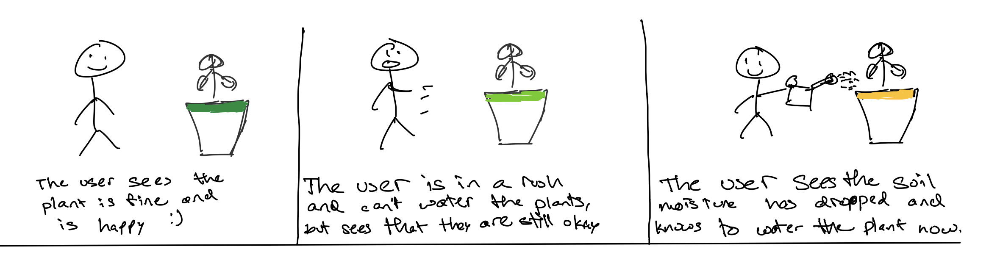
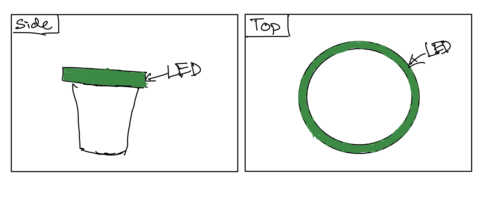
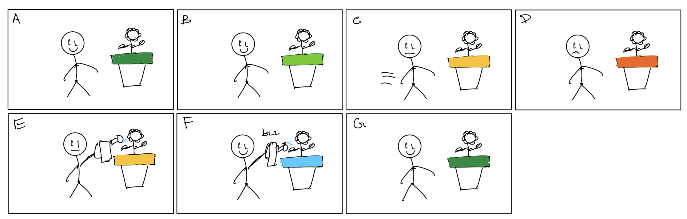
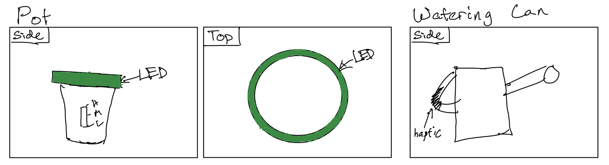

# Staging Interaction

In the original stage production of Peter Pan, Tinker Bell was represented by a darting light created by a small handheld mirror off-stage, reflecting a little circle of light from a powerful lamp. Tinkerbell communicates her presence through this light to the other characters. See more info [here](https://en.wikipedia.org/wiki/Tinker_Bell). 

There is no actor that plays Tinkerbell--her existence in the play comes from the interactions that the other characters have with her.

For lab this week, we draw on this and other inspirations from theatre to stage interactions with a device where the main mode of display/output for the interactive device you are designing is lighting. You will plot the interaction with a storyboard, and use your computer and a smartphone to experiment with what the interactions will look and feel like. 

_Make sure you read all the instructions and understand the whole of the laboratory activity before starting!_

## Prep

### To start the semester, you will need:
1. Read about Git [here](https://git-scm.com/book/en/v2/Getting-Started-What-is-Git%3F).
2. Set up your own Github "Lab Hub" repository to keep all you work in record by [following these instructions](https://github.com/FAR-Lab/Developing-and-Designing-Interactive-Devices/blob/2021Fall/readings/Submitting%20Labs.md).
3. Set up the README.md for your Hub repository (for instance, so that it has your name and points to your own Lab 1) and [learn how to](https://guides.github.com/features/mastering-markdown/) organize and post links to your submissions on your README.md so we can find them easily.

### For this lab, you will need:
1. Paper
2. Markers/ Pens
3. Scissors
4. Smart Phone -- The main required feature is that the phone needs to have a browser and display a webpage.
5. Computer -- We will use your computer to host a webpage which also features controls.
6. Found objects and materials -- You will have to costume your phone so that it looks like some other devices. These materials can include doll clothes, a paper lantern, a bottle, human clothes, a pillow case, etc. Be creative!

### Deliverables for this lab are: 
1. 7 Storyboards
1. 3 Sketches/photos of costumed devices
1. Any reflections you have on the process
1. Video sketch of 3 prototyped interactions
1. Submit the items above in the lab1 folder of your class [Github page], either as links or uploaded files. Each group member should post their own copy of the work to their own Lab Hub, even if some of the work is the same from each person in the group.

### The Report
This README.md page in your own repository should be edited to include the work you have done (the deliverables mentioned above). Following the format below, you can delete everything but the headers and the sections between the **stars**. Write the answers to the questions under the starred sentences. Include any material that explains what you did in this lab hub folder, and link it in your README.md for the lab.

## Lab Overview
For this assignment, you are going to:

A) [Plan](#part-a-plan) 

B) [Act out the interaction](#part-b-act-out-the-interaction) 

C) [Prototype the device](#part-c-prototype-the-device)

D) [Wizard the device](#part-d-wizard-the-device) 

E) [Costume the device](#part-e-costume-the-device)

F) [Record the interaction](#part-f-record)

Labs are due on Mondays. Make sure this page is linked to on your main class hub page.

## Part A. Plan 

To stage an interaction with your interactive device, think about:

_Setting:_ Where is this interaction happening? (e.g., a jungle, the kitchen) When is it happening?

_Players:_ Who is involved in the interaction? Who else is there? If you reflect on the design of current day interactive devices like the Amazon Alexa, it’s clear they didn’t take into account people who had roommates, or the presence of children. Think through all the people who are in the setting.

_Activity:_ What is happening between the actors?

_Goals:_ What are the goals of each player? (e.g., jumping to a tree, opening the fridge). 

The interactive device can be anything *except* a computer, a tablet computer or a smart phone, but the main way it interacts needs to be using light.

_Smart Pot:_ This pot will measure the soil moisture continuously and relay back the status through an LED ring on the top lip. This LED ring will change color gradually with respect to the soil moisture and will go through a color spectrum of green (100% moisture), yellow (50% moisture), and red (0% moisture).

\*\***Describe your setting, players, activity and goals here.**\*\*

_Setting:_ Around the house probably sometime in the afternoon.

_Players:_ Since this is a device to be used in a household, the hypothetical players can include any demographic, but the device is meant to mainly interact with the person watering/taking care of the plants.

_Activity:_ What is happening between the actors?
The user is to observe the status of the soil moisture through the pot's display light and, if needed, water the plant.

_Goals:_ What are the goals of each player? (e.g., jumping to a tree, opening the fridge). 
The goal of the user is to easily take care of their plants by not underwatering or overwatering them.

Storyboards are a tool for visually exploring a users interaction with a device. They are a fast and cheap method to understand user flow, and iterate on a design before attempting to build on it. Take some time to read through this explanation of [storyboarding in UX design](https://www.smashingmagazine.com/2017/10/storyboarding-ux-design/). Sketch seven storyboards of the interactions you are planning. **It does not need to be perfect**, but must get across the behavior of the interactive device and the other characters in the scene. 

\*\***Include pictures of your storyboards here**\*\*

Present your ideas to the other people in your breakout room (or in small groups). You can just get feedback from one another or you can work together on the other parts of the lab.

\*\***Summarize feedback you got here.**\*\*

--

## Part B. Act out the Interaction

Try physically acting out the interaction you planned. For now, you can just pretend the device is doing the things you’ve scripted for it. 

\*\***Are there things that seemed better on paper than acted out?**\*\*

--

\*\***Are there new ideas that occur to you or your collaborators that come up from the acting?**\*\*

--

## Part C. Prototype the device

You will be using your smartphone as a stand-in for the device you are prototyping. You will use the browser of your smart phone to act as a “light” and use a remote control interface to remotely change the light on that device. 

Code for the "Tinkerbelle" tool, and instructions for setting up the server and your phone are [here](https://github.com/FAR-Lab/tinkerbelle).

We invented this tool for this lab! 

If you run into technical issues with this tool, you can also use a light switch, dimmer, etc. that you can can manually or remotely control.

\*\***Give us feedback on Tinkerbelle.**\*\*

--

## Part D. Wizard the device
Take a little time to set up the wizarding set-up that allows for someone to remotely control the device while someone acts with it. Hint: You can use Zoom to record videos, and you can pin someone’s video feed if that is the scene which you want to record. 

\*\***Include your first attempts at recording the set-up video here.**\*\*

--

Now, hange the goal within the same setting, and update the interaction with the paper prototype. 

\*\***Show the follow-up work here.**\*\*

--

## Part E. Costume the device

Only now should you start worrying about what the device should look like. Develop three costumes so that you can use your phone as this device.

Think about the setting of the device: is the environment a place where the device could overheat? Is water a danger? Does it need to have bright colors in an emergency setting?

\*\***Include sketches of what your devices might look like here.**\*\*

\*\***What concerns or opportunitities are influencing the way you've designed the device to look?**\*\*

With respect to the LED, it follows the classic color spectrum of red, yellow, green (like a traffic light), and each color represents its corresponding connotation. Other than that, the device follows the classic look of a planting pot.

## Part F. Record

\*\***Take a video of your prototyped interaction.**\*\*

[video](https://www.youtube.com/watch?v=qjlqsSYkm5A)

\*\***Please indicate anyone you collaborated with on this Lab.**\*\*
Be generous in acknowledging their contributions! And also recognizing any other influences (e.g. from YouTube, Github, Twitter) that informed your design. 

--

# Staging Interaction, Part 2 

This describes the second week's work for this lab activity.

## Prep (to be done before Lab on Wednesday)

You will be assigned three partners from another group. Go to their github pages, view their videos, and provide them with reactions, suggestions & feedback: explain to them what you saw happening in their video. Guess the scene and the goals of the character. Ask them about anything that wasn’t clear. 

\*\***Summarize feedback from your partners here.**\*\*

## Make it your own

Do last week’s assignment again, but this time: 
1) It doesn’t have to (just) use light, 
2) You can use any modality (e.g., vibration, sound) to prototype the behaviors! Again, be creative! Feel free to fork and modify the tinkerbell code! 
3) We will be grading with an emphasis on creativity.

\*\***Document everything here. (Particularly, we would like to see the storyboard and video, although photos of the prototype are also great.)**\*\*

## Part A. Plan 

\*\***Device**\*\*

_Device:_ The interactive device being made is a smart plant pot. The pot will contain a display light around the top that will convey the status of the soil moisture by emitting different colors through the light. The soil moisture will be measured through an internal sensor periodically. There will be two types of the pot: an indoor version that is AC powered through a wall adapter and an outdoor verison that is remotely powered through a battery pack. Additionally, the pot will contain a slider switch for a low/medium/high soil moisture setting to account for different plant types. It will also feature an ability to interact with a watering can through bluetooth. If the user chooses to use the watering can to water the plant, it will will give haptic feedback to indicate when the user is close to overwatering the plant.

\*\***Describe your setting, players, activity and goals here.**\*\*

_Setting:_ Residential areas (outdoors or indoors).

_Players:_ Since the pot is to be used within or close to a residential area, the hypothetical players that interact with it can include any demographic. However, the device is intended to mainly interact with the person watering/taking care of the plants.

_Activity:_ What is happening between the actors?
The person taking care of the plants is to observe the status of the soil moisture through the pot's display light and, if needed, water the plant.

_Goals:_ What are the goals of each player? (e.g., jumping to a tree, opening the fridge). 
The goal of the user is to easily take care of their plants by not underwatering or overwatering them.

\*\***Include pictures of your storyboards here**\*\*

_Storyboard Description:_
1. User walks by the plant and sees that the moisture level is high.
2. User walks by the plant and sees the moisture level has started to fall, but it is still in the "good" zone.
3. User walks by the plant and sees the plant is in need of watering. However, user is in a rush, and is unable to currently water the plant. The user does know based on the current LED signal that the plant is not in drastic danger yet.
4. User is finally able to water the plant before it reaches critical condition.
5. User starts watering the plant and observes the LED returning back to a green condition.
6. User has reached the point at which the plant is in danger of being overwatered. User feels a vibration from the watering can, and the pot starts to blink blue as well.
7. User has stopped watering the plant, and the LED indicates a high moisture level.

\*\***Summarize feedback you got here.**\*\*

- How will you sense the change in soil moisture? Will it be dynamic or programmed in at the start?
    - The change in soil moisture will be sensed through an internal soil moisture sensor. It will be mostly automatic with the exception of the user indicating what level of soil mositure the plant "prefers"/needs.  
- Can you only use it indoors? If possible to use outdoors, how will it interact with the rain?
    - There will be an outdoor version; however, the only difference will be in how the pot is powered. In respect to interacting with the rain, since the pot will have an internal sensor measuring periodically, it should not be any different than watering the plant manually.
- Any other senses you can tap into?
    - Yes, I will be using haptic feedback at touch on the watering can. I am hesitant on using an alarm or any sound, as I feel if a continuous alarm was beeping if the moisture level was low, it would be more annoying than helpful.
- Helpful device.
    - Thanks :D.

## Part B. Act out the Interaction

Try physically acting out the interaction you planned. For now, you can just pretend the device is doing the things you’ve scripted for it. 

\*\***Are there things that seemed better on paper than acted out?**\*\*

At the moment, not really. The only cumbersome task for the user is holding the watering can during the vibration. Since I cannot simulate an real vibration on the handle, I am unable to judge how strong or weak it will need to be. I do think a level similar to a phone's vibration during a notification is significant enough, or perhaps an even lower level can be used, as the watering can will directly be in the user's hands as opposed to a phone being in someone's pocket, backpack, etc.

\*\***Are there new ideas that occur to you or your collaborators that come up from the acting?**\*\*

No new ideas, although the sound option (alarm) was revisited. However, for the most part, it was agreed upon that this would make the device more intrusive and annoying.

## Part C. Prototype the device

You will be using your smartphone as a stand-in for the device you are prototyping. You will use the browser of your smart phone to act as a “light” and use a remote control interface to remotely change the light on that device. 

Code for the "Tinkerbelle" tool, and instructions for setting up the server and your phone are [here](https://github.com/FAR-Lab/tinkerbelle).

We invented this tool for this lab! 

If you run into technical issues with this tool, you can also use a light switch, dimmer, etc. that you can can manually or remotely control.

\*\***Give us feedback on Tinkerbelle.**\*\*

It would be nice if you could program a sequence of colors to play automatically. However, I understand that is outside of the scope and probably defeats some of the purpose of manually acting out the interaction.

## Part D. Wizard the device
Take a little time to set up the wizarding set-up that allows for someone to remotely control the device while someone acts with it. Hint: You can use Zoom to record videos, and you can pin someone’s video feed if that is the scene which you want to record. 

\*\***Include your first attempts at recording the set-up video here.**\*\*

-- Same recording set up as Part 1

Now, hange the goal within the same setting, and update the interaction with the paper prototype. 

\*\***Show the follow-up work here.**\*\*

-- Same recording set up as Part 1

## Part E. Costume the device

Only now should you start worrying about what the device should look like. Develop three costumes so that you can use your phone as this device.

Think about the setting of the device: is the environment a place where the device could overheat? Is water a danger? Does it need to have bright colors in an emergency setting?

\*\***Include sketches of what your devices might look like here.**\*\*

\*\***What concerns or opportunitities are influencing the way you've designed the device to look?**\*\*

As with Part 1, the LED follows the classic color spectrum of red, yellow, green (like a traffic light), and each color represents its corresponding connotation. The LED will also now blink blue when the pot is getting close to being overwatered, as I felt this would be a good color to contrast with green and is also associated naturally with water. The smart pot still follows the classic look of a planting pot. The watering can also looks like a traditional watering can with the addition of a rubberized grip on the handle for haptic feedback.

## Part F. Record

\*\***Take a video of your prototyped interaction.**\*\*

[Link to video](https://youtu.be/ViYKUVQYG-o)

\*\***Please indicate anyone you collaborated with on this Lab.**\*\*
Be generous in acknowledging their contributions! And also recognizing any other influences (e.g. from YouTube, Github, Twitter) that informed your design. 

I would like to thank my classmates and group members who have provided me with much feedback that has helped me improve upon the device and create a better second iteration.

