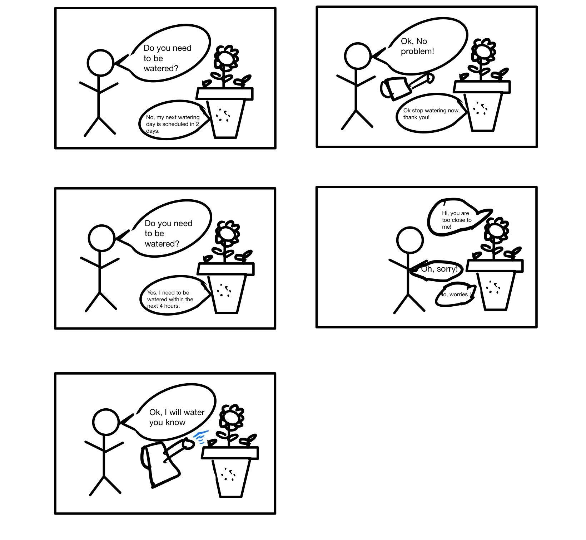
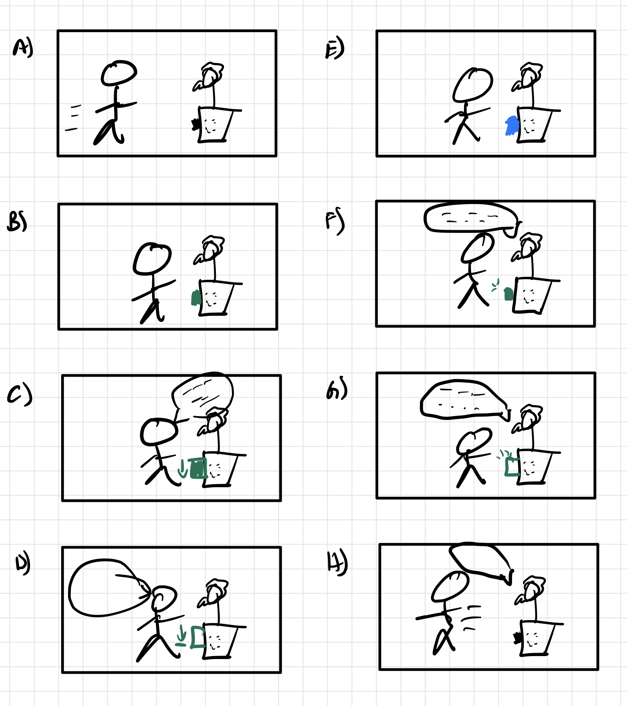
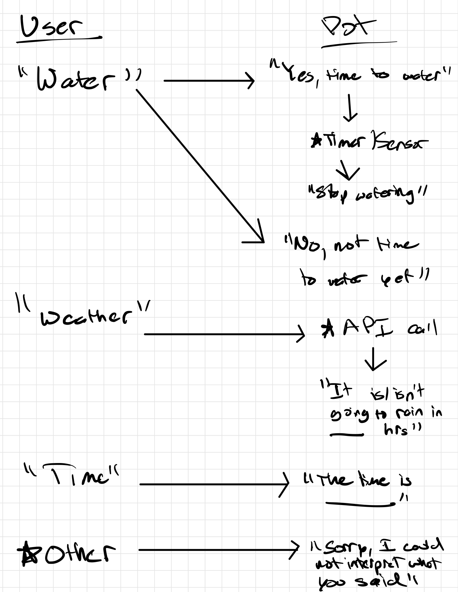

# Chatterboxes
**NAMES OF COLLABORATORS HERE**
[](https://www.youtube.com/embed/Q8FWzLMobx0?start=19)

In this lab, we want you to design interaction with a speech-enabled device--something that listens and talks to you. This device can do anything *but* control lights (since we already did that in Lab 1).  First, we want you first to storyboard what you imagine the conversational interaction to be like. Then, you will use wizarding techniques to elicit examples of what people might say, ask, or respond.  We then want you to use the examples collected from at least two other people to inform the redesign of the device.

We will focus on **audio** as the main modality for interaction to start; these general techniques can be extended to **video**, **haptics** or other interactive mechanisms in the second part of the Lab.

## Prep for Part 1: Get the Latest Content and Pick up Additional Parts 

### Pick up Web Camera If You Don't Have One

Students who have not already received a web camera will receive their [IMISES web cameras](https://www.amazon.com/Microphone-Speaker-Balance-Conference-Streaming/dp/B0B7B7SYSY/ref=sr_1_3?keywords=webcam%2Bwith%2Bmicrophone%2Band%2Bspeaker&qid=1663090960&s=electronics&sprefix=webcam%2Bwith%2Bmicrophone%2Band%2Bsp%2Celectronics%2C123&sr=1-3&th=1) on Thursday at the beginning of lab. If you cannot make it to class on Thursday, please contact the TAs to ensure you get your web camera. 

### Get the Latest Content

As always, pull updates from the class Interactive-Lab-Hub to both your Pi and your own GitHub repo. There are 2 ways you can do so:

**\[recommended\]**Option 1: On the Pi, `cd` to your `Interactive-Lab-Hub`, pull the updates from upstream (class lab-hub) and push the updates back to your own GitHub repo. You will need the *personal access token* for this.

```
pi@ixe00:~$ cd Interactive-Lab-Hub
pi@ixe00:~/Interactive-Lab-Hub $ git pull upstream Fall2022
pi@ixe00:~/Interactive-Lab-Hub $ git add .
pi@ixe00:~/Interactive-Lab-Hub $ git commit -m "get lab3 updates"
pi@ixe00:~/Interactive-Lab-Hub $ git push
```

Option 2: On your your own GitHub repo, [create pull request](https://github.com/FAR-Lab/Developing-and-Designing-Interactive-Devices/blob/2022Fall/readings/Submitting%20Labs.md) to get updates from the class Interactive-Lab-Hub. After you have latest updates online, go on your Pi, `cd` to your `Interactive-Lab-Hub` and use `git pull` to get updates from your own GitHub repo.

## Part 1.

### Text to Speech 

In this part of lab, we are going to start peeking into the world of audio on your Pi! 

We will be using the microphone and speaker on your webcamera. In the home directory of your Pi, there is a folder called `text2speech` containing several shell scripts. `cd` to the folder and list out all the files by `ls`:

```
pi@ixe00:~/text2speech $ ls
Download        festival_demo.sh  GoogleTTS_demo.sh  pico2text_demo.sh
espeak_demo.sh  flite_demo.sh     lookdave.wav
```

You can run these shell files by typing `./filename`, for example, typing `./espeak_demo.sh` and see what happens. Take some time to look at each script and see how it works. You can see a script by typing `cat filename`. For instance:

```
pi@ixe00:~/text2speech $ cat festival_demo.sh 
#from: https://elinux.org/RPi_Text_to_Speech_(Speech_Synthesis)#Festival_Text_to_Speech

echo "Just what do you think you're doing, Dave?" | festival --tts
```

Now, you might wonder what exactly is a `.sh` file? Typically, a `.sh` file is a shell script which you can execute in a terminal. The example files we offer here are for you to figure out the ways to play with audio on your Pi!

You can also play audio files directly with `aplay filename`. Try typing `aplay lookdave.wav`.

\*\***Write your own shell file to use your favorite of these TTS engines to have your Pi greet you by name.**\*\*
(This shell file should be saved to your own repo for this lab.)

Bonus: If this topic is very exciting to you, you can try out this new TTS system we recently learned about: https://github.com/rhasspy/larynx

### Speech to Text

Now examine the `speech2text` folder. We are using a speech recognition engine, [Vosk](https://alphacephei.com/vosk/), which is made by researchers at Carnegie Mellon University. Vosk is amazing because it is an offline speech recognition engine; that is, all the processing for the speech recognition is happening onboard the Raspberry Pi. 

In particular, look at `test_words.py` and make sure you understand how the vocab is defined. 
Now, we need to find out where your webcam's audio device is connected to the Pi. Use `arecord -l` to get the card and device number:
```
pi@ixe00:~/speech2text $ arecord -l
**** List of CAPTURE Hardware Devices ****
card 1: Device [Usb Audio Device], device 0: USB Audio [USB Audio]
  Subdevices: 1/1
  Subdevice #0: subdevice #0
```
The example above shows a scenario where the audio device is at card 1, device 0. Now, use `nano vosk_demo_mic.sh` and change the `hw` parameter. In the case as shown above, change it to `hw:1,0`, which stands for card 1, device 0.  

Now, look at which camera you have. Do you have the cylinder camera (likely the case if you received it when we first handed out kits), change the `-r 16000` parameter to `-r 44100`. If you have the IMISES camera, check if your rate parameter says `-r 16000`. Save the file using Write Out and press enter.

Then try `./vosk_demo_mic.sh`

\*\***Write your own shell file that verbally asks for a numerical based input (such as a phone number, zipcode, number of pets, etc) and records the answer the respondent provides.**\*\*

### Serving Pages

In Lab 1, we served a webpage with flask. In this lab, you may find it useful to serve a webpage for the controller on a remote device. Here is a simple example of a webserver.

```
pi@ixe00:~/Interactive-Lab-Hub/Lab 3 $ python server.py
 * Serving Flask app "server" (lazy loading)
 * Environment: production
   WARNING: This is a development server. Do not use it in a production deployment.
   Use a production WSGI server instead.
 * Debug mode: on
 * Running on http://0.0.0.0:5000/ (Press CTRL+C to quit)
 * Restarting with stat
 * Debugger is active!
 * Debugger PIN: 162-573-883
```
From a remote browser on the same network, check to make sure your webserver is working by going to `http://<YourPiIPAddress>:5000`. You should be able to see "Hello World" on the webpage.

### Storyboard

Storyboard and/or use a Verplank diagram to design a speech-enabled device. (Stuck? Make a device that talks for dogs. If that is too stupid, find an application that is better than that.) 

Main idea will be to develop a pant plot or maybe structure that holds plants in museums to help manage plant life. 

\*\***Post your storyboard and diagram here.**\*\*



Write out what you imagine the dialogue to be. Use cards, post-its, or whatever method helps you develop alternatives or group responses. 

\*\***Please describe and document your process.**\*\*

The planting structure will contain a number of useful tools for the user to interact with:
- Ask the pot whether the plant needs to be watered and it will relay back yes or no and the appropriate amount of water needed
- During the watering process, it will relay whether the user is close to overwatering the plant
- If the plant is kept in a museum or as some sort of display feature, it will alert people too close that might damage it
- If the plant is poisonous it will let passerbys now
- If the plant is kept outside, it will alert passerbys of weather conditions and temperature

### Acting out the dialogue

Find a partner, and *without sharing the script with your partner* try out the dialogue you've designed, where you (as the device designer) act as the device you are designing.  Please record this interaction (for example, using Zoom's record feature).

\*\***Describe if the dialogue seemed different than what you imagined when it was acted out, and how.**\*\*

### Wizarding with the Pi (optional)
In the [demo directory](./demo), you will find an example Wizard of Oz project. In that project, you can see how audio and sensor data is streamed from the Pi to a wizard controller that runs in the browser.  You may use this demo code as a template. By running the `app.py` script, you can see how audio and sensor data (Adafruit MPU-6050 6-DoF Accel and Gyro Sensor) is streamed from the Pi to a wizard controller that runs in the browser `http://<YouPiIPAddress>:5000`. You can control what the system says from the controller as well!

\*\***Describe if the dialogue seemed different than what you imagined, or when acted out, when it was wizarded, and how.**\*\*

# Lab 3 Part 2

For Part 2, you will redesign the interaction with the speech-enabled device using the data collected, as well as feedback from part 1.

## Prep for Part 2

1. What are concrete things that could use improvement in the design of your device? For example: wording, timing, anticipation of misunderstandings...
2. What are other modes of interaction _beyond speech_ that you might also use to clarify how to interact?
3. Make a new storyboard, diagram and/or script based on these reflections.

## Documentation

*Feedback received in part 1 was mostly centered around dialogue and the script; however, not entirely sure how technoloigcally feasible it will be to implement. Will summarize key takeaways and better implementations at the afterwards.*

1. The biggest consideration to take into account, as I am aiming at designing a fully autonomous system is timing. It will be crucial to make sure the camera is recording for enough time before "cutting" the user off and going to interpret the speech. It will also be necessary to ensure that the camera is not trying to record and "speak" at the same time. Anticipation of misunderstandings will be somewhat limited/accounted for, as I will use a small vocabulary base and make it so only one keyword (the first said) will be accounted for when making a decision on what to say back to the user. Finally, it will be necessary to give back helpful responses to the users that provide accurate insight.

2. The easiest and probably the most helpful interaction that can be added is lighting to indicate when the pot is at different stages in terms of recording, interpeting, and talking (and idling). This can be accomplished either through an LED or just using the RGB display or a combination of both. Another mode of interaction that can be added is proximity or gesture sensing. This will continue to make the experience hands free, and would also help with computational load, as the pi will not be in an always on state constantly recording. This would also put the user at ease if they are concerned with being recorded. 

3. ### Storyboard

- User walks close to the plant to activate proximity sensor and then recording
- User sees that pot is recording once LED turns on
- User speaks into plant pot while timer is visually going down
- User stops speaking once timer has visually run out
- User waits on pot to interpret what they just said
- User listens to pot telling it relevant info. while LED is flashing
- User listens to pot telling it relevant info. while LED is flashing
- User walks away once pot has stopped speaking to not activate proximity sensor again

4. ### Diagram



## Prototype your system

The system should:
* use the Raspberry Pi 
* use one or more sensors
* require participants to speak to it. 

*Document how the system works*

**Hardware/software utilized*
- Proxmity sensor
- Webcam
- Green LED
- RGB Display
- Text2Speech
- Speech2Text
- Weather API

**Entire code integration is present within [lab3.py](/lab3.py)*

```
if state == "Idle":
        green_button.LED_off()
        disp.fill(color565(0, 0, 0))
        text = ""
        if (apds.proximity > 10):
            state = "Recording"
    elif state == "Recording":
        green_button.LED_on(100)
        record_p = subprocess.Popen(record, shell=True)
        disp.fill(color565(0, 255, 0))
        time.sleep(1)
        disp.fill(color565(55, 205, 0))
        time.sleep(1)
        disp.fill(color565(155, 155, 0))
        time.sleep(1)
        disp.fill(color565(205, 105, 0))
        time.sleep(1)
        disp.fill(color565(255, 55, 0))
        time.sleep(1)
        disp.fill(color565(0, 0, 255))
        wf = wave.open("recorded_mono.wav", "rb")
        rec = KaldiRecognizer(model, wf.getframerate(), '["weather", "water", "time", "[unk]"]')
        state = "Interpret"
    elif state == "Interpret":
        green_button.LED_off()
        data = wf.readframes(4000)
        if len(data) == 0:
            state = "Talking"
        else:
            if rec.AcceptWaveform(data):
                (rec.Result())
            else:
                (rec.PartialResult())

            txt = json.loads(rec.FinalResult()).get("text")
            if txt != "":
                text += txt
                state = "Talking"
    elif state == "Talking":
        disp.fill(color565(0, 0, 0))
        talk_text = ""
        if text == "water":
            if random.random() < .5:
                talk_text = "Yes, it is time to water the plant now"
            else:
                talk_text = "No, it is not time to water the plant"
        elif text == "weather":
            response = requests.get(api_endpoint, params=weather_params)
            response.raise_for_status()
            weather_data = response.json()
            i = 0
            for list in weather_data["list"]:
                print(list["pop"])
                if i == 4:
                    talk_text = "it will not rain within the next 12 hours"
                    break
                if list["pop"] > .8:
                    talk_text = "it will rain within the next 12 hours"
                    break
                i+=1
        elif text == "time":
            now = datetime.now()
            time = now.strftime("%H:%M")
            talk_text = "It is " + time
        else:
            talk_text = "Sorry, I cannot interpret what you just said, please try again"
        
        say = subprocess.Popen('say() { local IFS=+;/usr/bin/mplayer -ao alsa -really-quiet -noconsolecontrols "http://translate.google.com/translate_tts?ie=UTF-8&client=tw-ob&q=$*&tl=en"; } ; say "' +  talk_text + '"', shell=True)
        if say.poll() is None:
            if talk_text == "Yes, it is time to water the plant now":
                time.sleep(5)
                talk_text = "Ok, now stop watering"
                say = subprocess.Popen('say() { local IFS=+;/usr/bin/mplayer -ao alsa -really-quiet -noconsolecontrols "http://translate.google.com/translate_tts?ie=UTF-8&client=tw-ob&q=$*&tl=en"; } ; say "' +  talk_text + '"', shell=True)
                time.sleep(1)
            state = "Idle"
```

*Include videos or screencaptures of both the system and the controller.*

[Link to Demo Video](https://www.youtube.com/watch?v=ck0bsNOzOrg)

## Test the system
Try to get at least two people to interact with your system. (Ideally, you would inform them that there is a wizard _after_ the interaction, but we recognize that can be hard.)

Answer the following:

### What worked well about the system and what didn't?
\*\**Most people said that the commands provided helpful and accurate information. However, they felt that functionality overall was a little lacking, and more could be implemented to make the pot feel actually useful. Probably the biggest criticism was that conversation felt unnatural and also one line commands were weird in practice.*\*\*

### What worked well about the controller and what didn't?

\*\**I didn't use a controller for this lab, as the pi was fully autonomous.*\*\*

### What lessons can you take away from the WoZ interactions for designing a more autonomous version of the system?

\*\**While I did not use a controller for the lab, I believe I do have some helpful insights from my autonomous testing into making the system better. The first I would do is make it so that the pot is able to interpret sentence commands. Technically, the code is already there, but I was not sure, and it is very primitive in the sense that the current version of the pot will simply take the first key word said and "run with it". The second is possibly integrating the gesture functionality. While the proximity feature does the job, I feel like using only gestures to activate the pot will make it much more intutive for the user and also prevent any accidental triggerings of the pot.*\*\*


### How could you use your system to create a dataset of interaction? What other sensing modalities would make sense to capture?

\*\**Perhaps the biggest would be capturing how often the user actually waters the plants in respect to multiple factors. The first would be, did the user bother to check with the pot before watering the plant? The second would be, did the user check with the pot, and did they disregard the advice the pot gave? The third would be, how often does the user even interact with the pot/plant in the first place? Finally, when the user waters the plant, do they heed the overwatering warning the pot signals or gives out? Sensors that could aid in the capturing of this data include soil hydration sensors, proximity/gesture sensors, and perhaps CV/cameras (although that might be overkill).*\*\*
