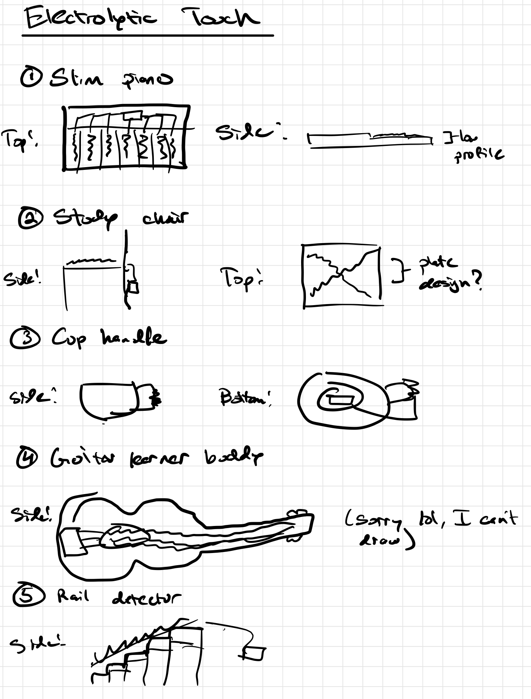
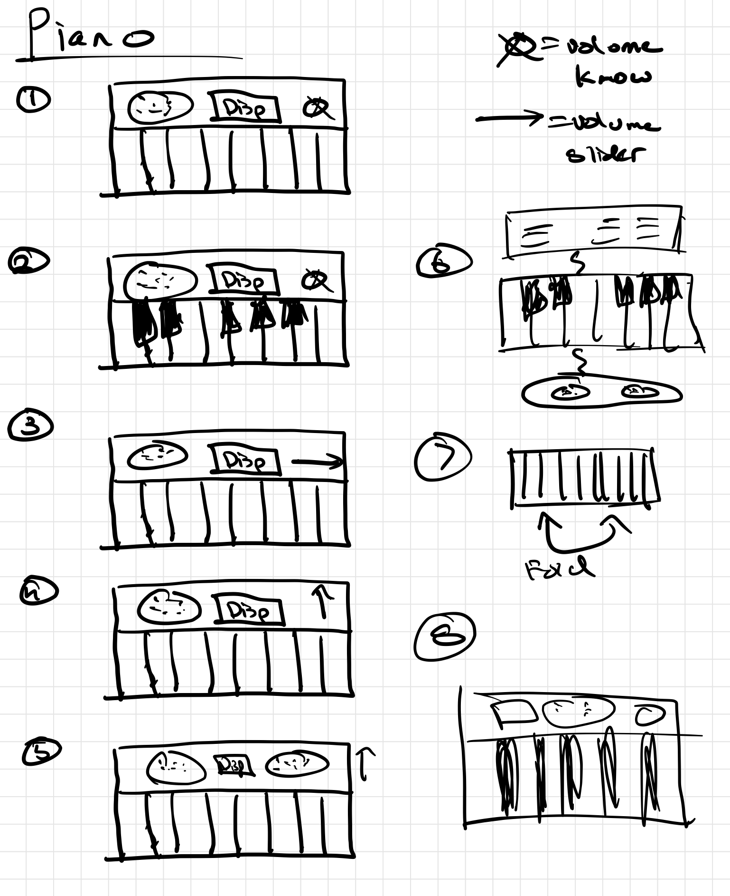
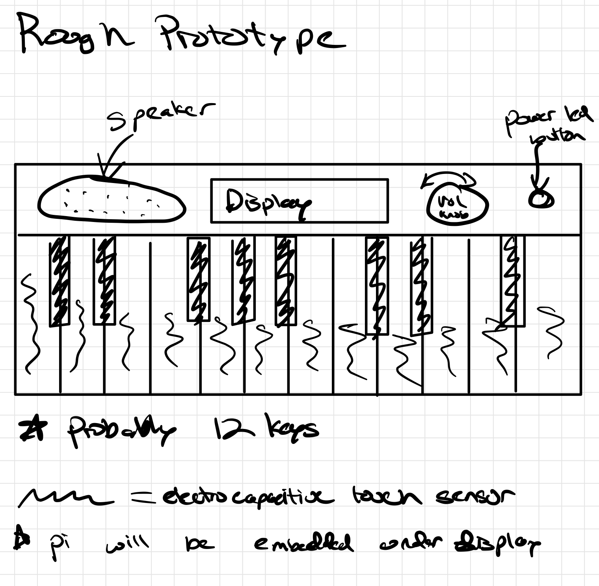
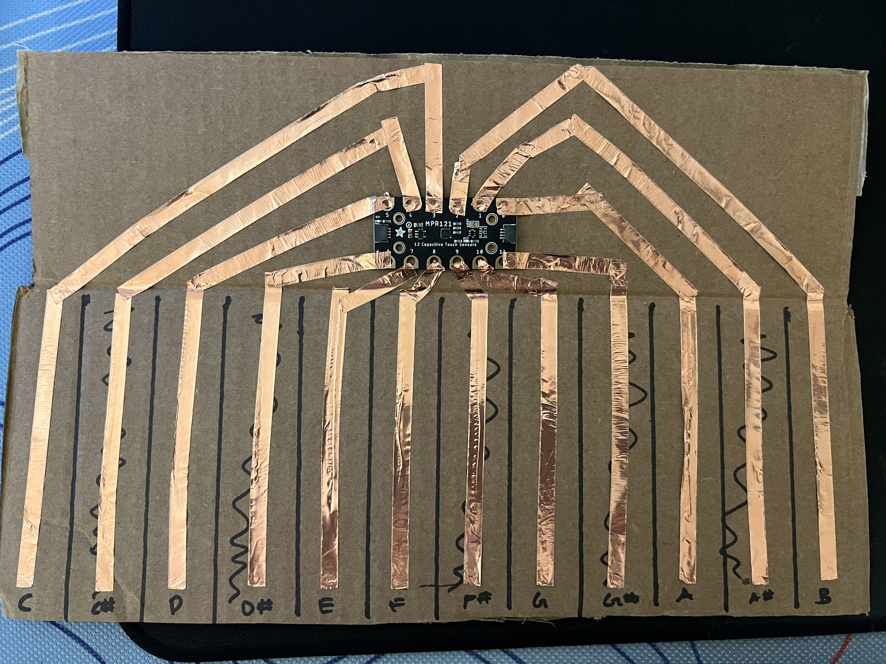
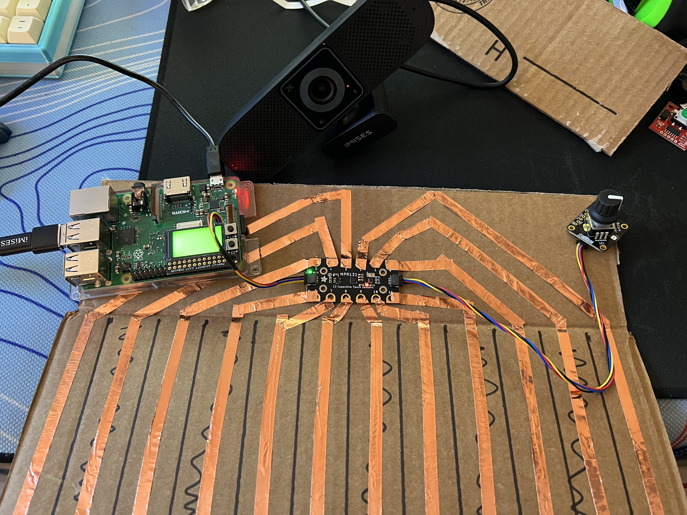
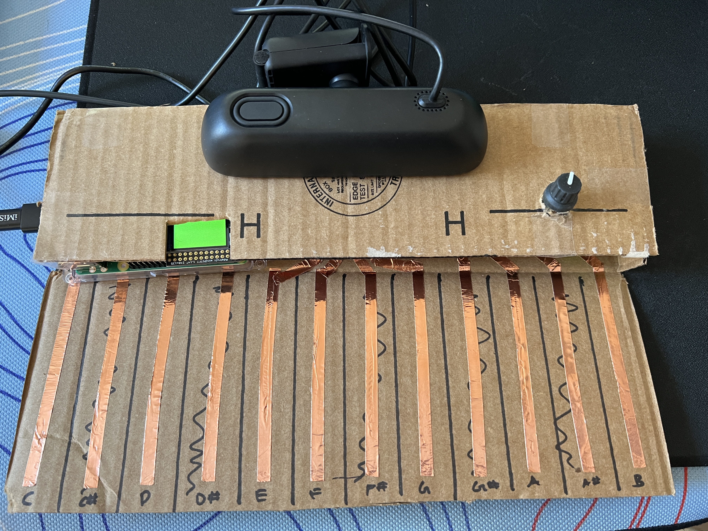
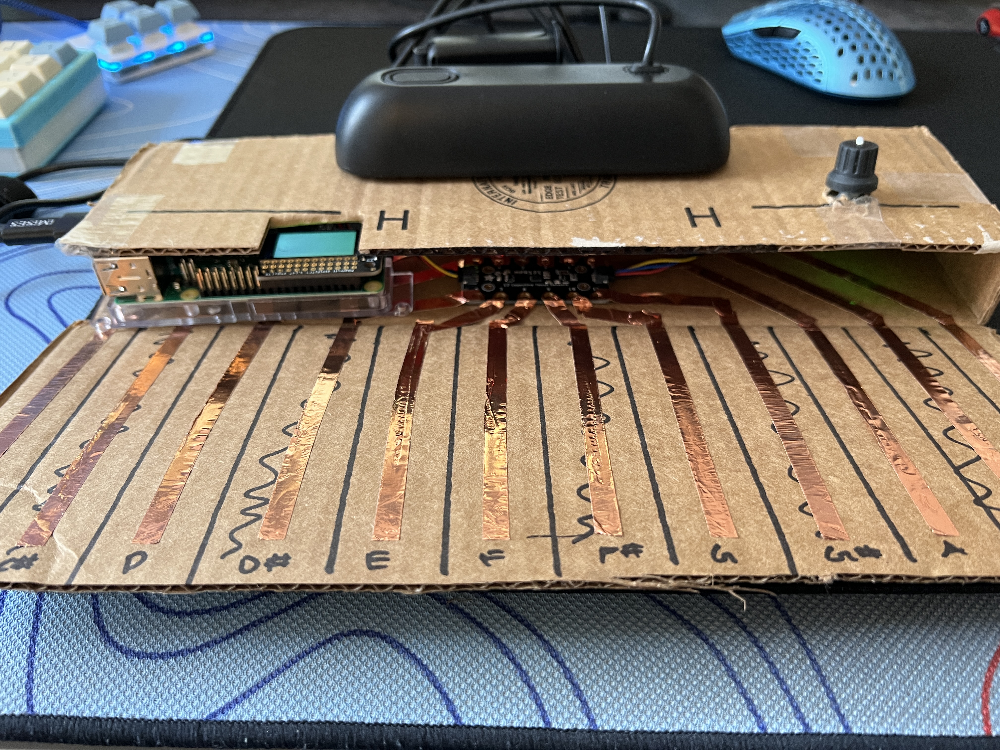
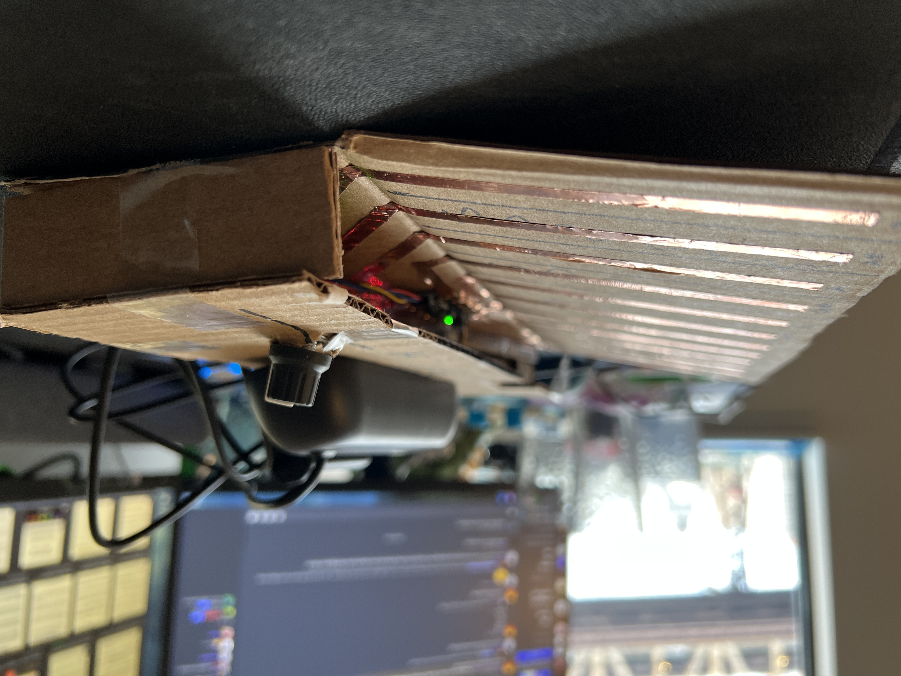

# Ph-UI!!!

**NAMES OF COLLABORATORS HERE**


For lab this week, we focus both on sensing, to bring in new modes of input into your devices, as well as prototyping the physical look and feel of the device. You will think about the physical form the device needs to perform the sensing as well as present the display or feedback about what was sensed. 

## Part 1 Lab Preparation

### Get the latest content:
As always, pull updates from the class Interactive-Lab-Hub to both your Pi and your own GitHub repo. As we discussed in the class, there are 2 ways you can do so:

**\[recommended\]**Option 1: On the Pi, `cd` to your `Interactive-Lab-Hub`, pull the updates from upstream (class lab-hub) and push the updates back to your own GitHub repo. You will need the personal access token for this.

```
pi@ixe00:~$ cd Interactive-Lab-Hub
pi@ixe00:~/Interactive-Lab-Hub $ git pull upstream Fall2022
pi@ixe00:~/Interactive-Lab-Hub $ git add .
pi@ixe00:~/Interactive-Lab-Hub $ git commit -m "get lab4 content"
pi@ixe00:~/Interactive-Lab-Hub $ git push
```

Option 2: On your your own GitHub repo, [create pull request](https://github.com/FAR-Lab/Developing-and-Designing-Interactive-Devices/blob/2021Fall/readings/Submitting%20Labs.md) to get updates from the class Interactive-Lab-Hub. After you have latest updates online, go on your Pi, `cd` to your `Interactive-Lab-Hub` and use `git pull` to get updates from your own GitHub repo.

### Start brasinstorming ideas by reading: 
* [What do prototypes prototype?](https://www.semanticscholar.org/paper/What-do-Prototypes-Prototype-Houde-Hill/30bc6125fab9d9b2d5854223aeea7900a218f149)
* [Paper prototyping](https://www.uxpin.com/studio/blog/paper-prototyping-the-practical-beginners-guide/) is used by UX designers to quickly develop interface ideas and run them by people before any programming occurs. 
* [Cardboard prototypes](https://www.youtube.com/watch?v=k_9Q-KDSb9o) help interactive product designers to work through additional issues, like how big something should be, how it could be carried, where it would sit. 
* [Tips to Cut, Fold, Mold and Papier-Mache Cardboard](https://makezine.com/2016/04/21/working-with-cardboard-tips-cut-fold-mold-papier-mache/) from Make Magazine.
* [Surprisingly complicated forms](https://www.pinterest.com/pin/50032245843343100/) can be built with paper, cardstock or cardboard.  The most advanced and challenging prototypes to prototype with paper are [cardboard mechanisms](https://www.pinterest.com/helgangchin/paper-mechanisms/) which move and change. 
* [Dyson Vacuum Cardboard Prototypes](http://media.dyson.com/downloads/JDF/JDF_Prim_poster05.pdf)
<p align="center"> </p>

### Gathering materials for this lab:

* Cardboard (start collecting those shipping boxes!)
* Found objects and materials--like bananas and twigs.
* Cutting board
* Cutting tools
* Markers

(We do offer shared cutting board, cutting tools, and markers on the class cart during the lab, so do not worry if you don't have them!)

## Deliverables \& Submission for Lab 4

The deliverables for this lab are, writings, sketches, photos, and videos that show what your prototype:
* "Looks like": shows how the device should look, feel, sit, weigh, etc.
* "Works like": shows what the device can do.
* "Acts like": shows how a person would interact with the device.

For submission, the readme.md page for this lab should be edited to include the work you have done:
* Upload any materials that explain what you did, into your lab 4 repository, and link them in your lab 4 readme.md.
* Link your Lab 4 readme.md in your main Interactive-Lab-Hub readme.md. 
* Group members can turn in one repository, but make sure your Hub readme.md links to the shared repository.
* Labs are due on Mondays, make sure to submit your Lab 4 readme.md to Canvas.


## Lab Overview

A) [Capacitive Sensing](#part-a)

B) [OLED screen](#part-b) 

C) [Paper Display](#part-c)

D) [Materiality](#part-d)

E) [Servo Control](#part-e)

F) [Record the interaction](#part-f)

## The Report (Part 1: A-D, Part 2: E-F)

### Part A
### Capacitive Sensing, a.k.a. Human-Twizzler Interaction 

We want to introduce you to the [capacitive sensor](https://learn.adafruit.com/adafruit-mpr121-gator) in your kit. It's one of the most flexible input devices we are able to provide. At boot, it measures the capacitance on each of the 12 contacts. Whenever that capacitance changes, it considers it a user touch. You can attach any conductive material. In your kit, you have copper tape that will work well, but don't limit yourself! In the example below, we use Twizzlers--you should pick your own objects.


<p float="left">


</p>

Plug in the capacitive sensor board with the QWIIC connector. Connect your Twizzlers with either the copper tape or the alligator clips (the clips work better). In this lab, we will continue to use the `circuitpython` virtual environment we created before. Activate `circuitpython` and `cd` to your Lab 4 folder to install the requirements by:

```
(circuitpython) pi@ixe00:~/Interactive-Lab-Hub/Lab 4 $ pip3 install -r requirements.txt
```


These Twizzlers are connected to pads 6 and 10. When you run the code and touch a Twizzler, the terminal will print out the following

```
(circuitpython) pi@ixe00:~/Interactive-Lab-Hub/Lab 4 $ python cap_test.py 
Twizzler 10 touched!
Twizzler 6 touched!
```

### Part B
### More sensors

#### Light/Proximity/Gesture sensor (APDS-9960)

We here want you to get to know this awesome sensor [Adafruit APDS-9960](https://www.adafruit.com/product/3595). It is capable of sensing proximity, light (also RGB), and gesture! 


Connect it to your pi with Qwiic connector and try running the three example scripts individually to see what the sensor is capable of doing!

```
(circuitpython) pi@ixe00:~/Interactive-Lab-Hub/Lab 4 $ python proximity_test.py
...
(circuitpython) pi@ixe00:~/Interactive-Lab-Hub/Lab 4 $ python gesture_test.py
...
(circuitpython) pi@ixe00:~/Interactive-Lab-Hub/Lab 4 $ python color_test.py
...
```

You can go the the [Adafruit GitHub Page](https://github.com/adafruit/Adafruit_CircuitPython_APDS9960) to see more examples for this sensor!

#### Rotary Encoder

A rotary encoder is an electro-mechanical device that converts the angular position to analog or digital output signals. The [Adafruit rotary encoder](https://www.adafruit.com/product/4991#technical-details) we ordered for you came with separated breakout board and encoder itself, that is, they will need to be soldered if you have not yet done so! We will be bringing the soldering station to the lab class for you to use, also, you can go to the MakerLAB to do the soldering off-class. Here is some [guidance on soldering](https://learn.adafruit.com/adafruit-guide-excellent-soldering/preparation) from Adafruit. When you first solder, get someone who has done it before (ideally in the MakerLAB environment). It is a good idea to review this material beforehand so you know what to look at.

<p float="left">


</p>

Connect it to your pi with Qwiic connector and try running the example script, it comes with an additional button which might be useful for your design!

```
(circuitpython) pi@ixe00:~/Interactive-Lab-Hub/Lab 4 $ python encoder_test.py
```

You can go to the [Adafruit Learn Page](https://learn.adafruit.com/adafruit-i2c-qt-rotary-encoder/python-circuitpython) to learn more about the sensor! The sensor actually comes with an LED (neo pixel): Can you try lighting it up? 

#### Joystick

A [joystick](https://www.sparkfun.com/products/15168) can be used to sense and report the input of the stick for it pivoting angle or direction. It also comes with a button input!

<p float="left">

</p>

Connect it to your pi with Qwiic connector and try running the example script to see what it can do!

```
(circuitpython) pi@ixe00:~/Interactive-Lab-Hub/Lab 4 $ python joystick_test.py
```

You can go to the [SparkFun GitHub Page](https://github.com/sparkfun/Qwiic_Joystick_Py) to learn more about the sensor!

#### Distance Sensor

Earlier we have asked you to play with the proximity sensor, which is able to sense object within a short distance. Here, we offer [Qwiic Multi Distance Sensor](https://www.sparkfun.com/products/17072), which has a field of view of about 25° and is able to detect objects up to 3 meters away! 

<p float="left">

</p>

Connect it to your pi with Qwiic connector and try running the example script to see how it works!

```
(circuitpython) pi@ixe00:~/Interactive-Lab-Hub/Lab 4 $ python distance_test.py
```

You can go to the [SparkFun GitHub Page](https://github.com/sparkfun/Qwiic_VL53L1X_Py) to learn more about the sensor and see other examples!

### Part C
### Physical considerations for sensing

Usually, sensors need to positioned in specific locations or orientations to make them useful for their application. Now that you've tried a bunch of the sensors, pick one that you would like to use, and an application where you use the output of that sensor for an interaction. For example, you can use a distance sensor to measure someone's height if you position it overhead and get them to stand under it.

**\*\*\*Draw 5 sketches of different ways you might use your sensor, and how the larger device needs to be shaped in order to make the sensor useful.\*\*\***



>Sketches:
> 1. Slim electrolytic capacitive touch sensor keyboard. Will be easily portable and contain less moving parts to ensure durability. 
> 2. Study chair that tracks amount of time someone has been studying through electrolytic capacitive plate on the seat. Will be hooked up to some sort of reward/penalization system for amount of time spent studying.
> 3. Cup handle with electrolytic capacitive touch sensing to send warnings to the user when they touch the handle on whether the cup is too hot or not. Should be able to detect "touch" right before the user actually touches the handle.
> 4. Guitar learner buddy with strings hooked up to electrolytic capacitive touch sensors. Will help users learn guitar by giving feedback on if they are touching the correct strings or not.
> 5. Rail detector to ensure that blind people are able to get realtime feedback on if they are touching the correct guiding rail. Could also be expanded to other demographics such as the elderly.

**\*\*\*What are some things these sketches raise as questions? What do you need to physically prototype to understand how to anwer those questions?\*\*\***

>There are multiple questions/concerns to address:
> - How far will sensing pads need to be placed to allow for comfortable use of the device?
> - How far will sensing pads need to be placed to prevent accidental triggers or multiple triggers at once?
> - How to write all sensing pads to the sensor without intersections or overlap?
> - Will the device require multiple hands or even fingers at once? Will the sensor be able to keep up with multiples inputs?
> - Will any additional sensors be used and will that cause too much delay in sensing touch?
> - What is the threshold before the sensor detects an input on one of the pads?
> - How many sensor pads will the device be constrained to (i.e. the max amount of inputs)?

>With regards to the physical prototyping:
> - Will have to test out pad distances and see what distance thresholds are.
> - Will have to see if maybe matrix formations are possible or if the sensor is limited to 12 inputs.
> - Will have to see sensor lag in general and processing speed.

**\*\*\*Pick one of these designs to prototype.\*\*\***

> Electrocapacitive touch sensor piano keyboard

### Part D
### Physical considerations for displaying information and housing parts


Here is an Pi with a paper faceplate on it to turn it into a display interface:


This is fine, but the mounting of the display constrains the display location and orientation a lot. Also, it really only works for applications where people can come and stand over the Pi, or where you can mount the Pi to the wall.

Here is another prototype for a paper display:


Your kit includes these [SparkFun Qwiic OLED screens](https://www.sparkfun.com/products/17153). These use less power than the MiniTFTs you have mounted on the GPIO pins of the Pi, but, more importantly, they can be more flexibily be mounted elsewhere on your physical interface. The way you program this display is almost identical to the way you program a  Pi display. Take a look at `oled_test.py` and some more of the [Adafruit examples](https://github.com/adafruit/Adafruit_CircuitPython_SSD1306/tree/master/examples).

<p float="left">


</p>


It holds a Pi and usb power supply, and provides a front stage on which to put writing, graphics, LEDs, buttons or displays.

This design can be made by scoring a long strip of corrugated cardboard of width X, with the following measurements:

| Y height of box <br> <sub><sup>- thickness of cardboard</sup></sub> | Z  depth of box <br><sub><sup>- thickness of cardboard</sup></sub> | Y height of box  | Z  depth of box | H height of faceplate <br><sub><sup>* * * * * (don't make this too short) * * * * *</sup></sub>|
| --- | --- | --- | --- | --- | 

Fold the first flap of the strip so that it sits flush against the back of the face plate, and tape, velcro or hot glue it in place. This will make a H x X interface, with a box of Z x X footprint (which you can adapt to the things you want to put in the box) and a height Y in the back. 

Here is an example:


Think about how you want to present the information about what your sensor is sensing! Design a paper display for your project that communicates the state of the Pi and a sensor. Ideally you should design it so that you can slide the Pi out to work on the circuit or programming, and then slide it back in and reattach a few wires to be back in operation.
 
**\*\*\*Sketch 5 designs for how you would physically position your display and any buttons or knobs needed to interact with it.\*\*\***


>Sketch differentiators:
> 1. Whether to have evenly spaced keys or keys resembling a typical piano. Will be harder to implement "normal" piano keys due to height and width differences causing some potential for misinputs.
> 2. Portability factors: maybe foldable to stowaway easier and travel with, maybe modular for the same reasons and also allows for the ability to swap out components as needed.
> 3. Not sure what components/layout of the components will be on the top panel. Will for sure use a display and rotary encoder for volume control. Pi will most likely be embedded underneath. Not sure if camera speaker with be flush with top panel or will lay on top due to size.

**\*\*\*What are some things these sketches raise as questions? What do you need to physically prototype to understand how to anwer those questions?\*\*\***

>There are multiple questions/concerns to address:
> - Evenly spaced or normal piano keys?
> - Speaker width/dimensions cause some sort of pain with building?
> - How to attach touch sensor to all key pads?
> - What will display be used for and will it have much meaning/ is it even necessary?
> - Volume slider or knob? Is it possible to even make a slider?
> - Any form factor changes?

>With regards to the physical prototyping:
> - Will experiment with different models/designs.
> - Will take into account key pad routing first when building prototypes, as that is probably the most tedious and important part.
> - Will look into speaker dimensions.
> - Will try different top panel designs and pick the one most feasible to implement and use.

**\*\*\*Pick one of these display designs to integrate into your prototype.\*\*\***

> Will use a design consisting of evenly sized keys consisting of display, speaker, and volume knob attached to the top panel. Will iron out more details after actually physically prototyping and seeing what cardboard designs are possible. Will also see what looks aesthetically pleasing.

**\*\*\*Explain the rationale for the design.\*\*\*** (e.g. Does it need to be a certain size or form or need to be able to be seen from a certain distance?)

> This should be one of the easier designs to actually make and will also look similar to a normal piano keyboard. Size will be 12 inches wide (1 inch for each key in an octave) with height dependent on raspberry pi height and depth dependent on cardboard scraps available.

Build a cardbord prototype of your design.

**\*\*\*Document your rough prototype.\*\*\***


> Prototype will be documented in part 2.

LAB PART 2

### Part 2

Following exploration and reflection from Part 1, complete the "looks like," "works like" and "acts like" prototypes for your design, reiterated below.

### Part E (Optional)
### Servo Control with Joystick

In the class kit, you should be able to find the [Qwiic Servo Controller](https://www.sparkfun.com/products/16773) and [Micro Servo Motor SG51](https://www.adafruit.com/product/2201). The Qwiic Servo Controller will need external power supply to drive, which are included in your kit. Connect the servo controller to the miniPiTFT through qwiic connector and connect the external battery to the 2-Pin JST port (ower port) on the servo controller. Connect your servo to channel 2 on the controller, make sure the brown is connected to GND and orange is connected to PWM.


In this exercise, we will be using the nice [ServoKit library](https://learn.adafruit.com/16-channel-pwm-servo-driver/python-circuitpython) developed by Adafruit! We will continue to use the `circuitpython` virtual environment we created. Activate the virtual environment and make sure to install the latest required libraries by running:

```
(circuitpython) pi@ixe00:~/Interactive-Lab-Hub/Lab 4 $ pip3 install -r requirements.txt
```

A servo motor is a rotary actuator or linear actuator that allows for precise control of angular or linear position. The position of a servo motor is set by the width of an electrical pulse, that is, we can use PWM (pulse-width modulation) to set and control the servo motor position. You can read [this](https://learn.adafruit.com/adafruit-arduino-lesson-14-servo-motors/servo-motors) to learn a bit more about how exactly a servo motor works.

Now that you have a basic idea of what a servo motor is, look into the script `qwiic_servo_example.py` we provide. In line 14, you should see that we have set up the min_pulse and max_pulse corresponding to the servo turning 0 - 180 degree. Try running the servo example code now and see what happens:

```
(circuitpython) pi@ixe00:~/Interactive-Lab-Hub/Lab 4 $ python servo_test.py
```

It is also possible to control the servo using the sensors mentioned in as in part A and part B, and/or from some of the buttons or parts included in your kit, the simplest way might be to chain Qwiic buttons to the other end of the Qwiic OLED. Like this:

<p align="center"> </p>

You can then call whichever control you like rather than setting a fixed value for the servo. For more information on controlling Qwiic devices, Sparkfun has several python examples, such as [this](https://learn.sparkfun.com/tutorials/qwiic-joystick-hookup-guide/all#python-examples).

We encourage you to try using these controls, **while** paying particular attention to how the interaction changes depending on the position of the controls. For example, if you have your servo rotating a screen (or a piece of cardboard) from one position to another, what changes about the interaction if the control is on the same side of the screen, or the opposite side of the screen? Trying and retrying different configurations generally helps reveal what a design choice changes about the interaction -- _make sure to document what you tried_!

### Part F
### Record

Document all the prototypes and iterations you have designed and worked on! Again, deliverables for this lab are writings, sketches, photos, and videos that show what your prototype:
* "Looks like": shows how the device should look, feel, sit, weigh, etc.
* "Works like": shows what the device can do
* "Acts like": shows how a person would interact with the device

### Documentation

**Parts used**
> Software:
> - musicalbeeps library
> - mpr121 library
> - seesaw library
> - st7789 library

> Hardware:
> - Camera as a speaker
> - Mpr121 touch sensor
> - Copper tape as touch pads
> - Rotary encoder for volume control
> - Mini display for volume level indication

**Code**
*located within [lab4.py](./lab4.py)*
```
import time
import board
import busio
import musicalbeeps
import digitalio as digitalio2

import adafruit_mpr121
from adafruit_seesaw import seesaw, rotaryio, digitalio

from PIL import Image, ImageDraw, ImageFont
import adafruit_rgb_display.st7789 as st7789
from adafruit_rgb_display.rgb import color565

# Setup SPI bus using hardware SPI:
spi = board.SPI()

# Configuration for CS and DC pins (these are FeatherWing defaults on M0/M4):
cs_pin = digitalio2.DigitalInOut(board.CE0)
dc_pin = digitalio2.DigitalInOut(board.D25)
reset_pin = None


# Config for display baudrate (default max is 24mhz):
BAUDRATE = 64000000

disp = st7789.ST7789(
    spi,
    cs=cs_pin,
    dc=dc_pin,
    rst=reset_pin,
    baudrate=BAUDRATE,
    width=135,
    height=240,
    x_offset=53,
    y_offset=40,
)

height = disp.width  # we swap height/width to rotate it to landscape!
width = disp.height
image = Image.new("RGB", (width, height))
rotation = 90

# Get drawing object to draw on image.
draw = ImageDraw.Draw(image)
disp.image(image, rotation)

# Turn on the backlight
backlight = digitalio2.DigitalInOut(board.D22)
backlight.switch_to_output()
backlight.value = True

draw.rectangle((0, 0, width, height), outline=0, fill=(0, 255, 255))

i2c = busio.I2C(board.SCL, board.SDA)
seesaw = seesaw.Seesaw(board.I2C(), addr=0x36)
seesaw.pin_mode(24, seesaw.INPUT_PULLUP)
button = digitalio.DigitalIO(seesaw, 24)
button_held = False
encoder = rotaryio.IncrementalEncoder(seesaw)

mpr121 = adafruit_mpr121.MPR121(i2c)
player = musicalbeeps.Player(volume = 0.1,
                            mute_output = False)


while True:

    player.volume  = (-encoder.position % 100) / 100

    disp.fill(color565(0, int(255 * player.volume), 0))
    if mpr121[0].value:
        player.play_note("A", .25)
    elif mpr121[1].value:
        player.play_note("A#", .25)
    elif mpr121[2].value:
        player.play_note("B", .25)
    elif mpr121[3].value:
        player.play_note("C", .25)
    elif mpr121[4].value:
        player.play_note("C#", .25)
    elif mpr121[5].value:
        player.play_note("D", .25)
    elif mpr121[6].value:
        player.play_note("D#", .25)
    elif mpr121[7].value:
        player.play_note("E", .25)
    elif mpr121[8].value:
        player.play_note("F", .25)
    elif mpr121[9].value:
        player.play_note("F#", .25)
    elif mpr121[10].value:
        player.play_note("G", .25)
    elif mpr121[11].value:
        player.play_note("G#", .25)
    else:
        player.play_note("pause", .25)
    time.sleep(.25)  # Small delay to keep from spamming output messages.
```

**Prototyping process**
> - Original idea is located in part 1
> - For the most part, continued with the original sketch
> - Was unable to place the speaker/camera beneath the top panel as it was too big, so just laid it on top
> - Electrolytic capacitive touch sensors required careful planning with regards to routing the copper tape
> - Were quite a few troubleshooting issues with the touch sensors due to some spillover charge problems
> - Display was originally planned to hold a numerical value of the volume, but there were issues with the draw library, so a LED indicator was used instead
> - Attempted to use keys similar to a normal piano, but was too difficult to also account for electrolytic capacitive routing

**Final prototype description**
> - Display goes from black to green (increase G value) based on current volume
> - Rotary encoder is not constrained by bounds so rotating multiple times to the right for example causes volume to go from max -> min. This is desired
> - 12 keys which are labeled represent the 4th octave
> - Keys can only be played once at a time (monotonic) due to limitations of music playing library
> - Keys are spaced evenly apart, which aids with monotonic playing
> - Limitations of music playing library cause sort of a stutter with held notes as the player essentially plays -> stops for a millisecond -> plays within the loop.

**Final prototype photos**

*Electrolytic routing*

*Internals before top panel is placed on*

*Final top view*

*Final front view*

*Final side view*


**Video demonstrating final prototype usage**

[](https://www.youtube.com/watch?v=qply7gzr-ZM)
