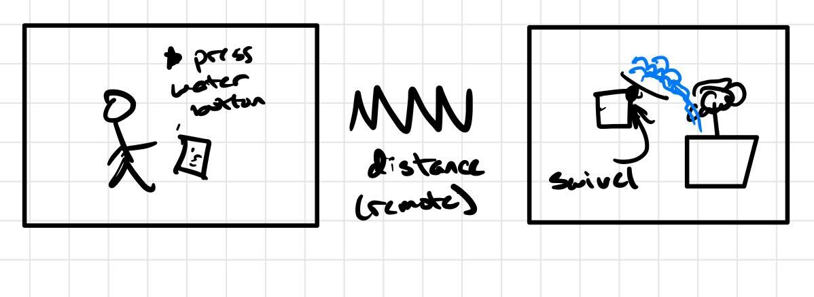
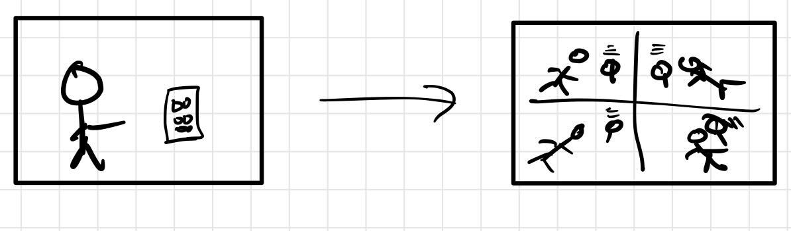
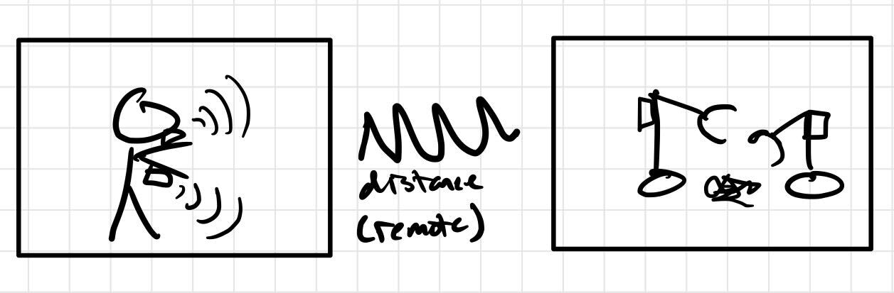
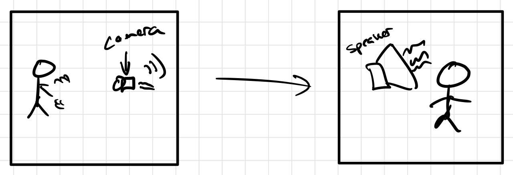
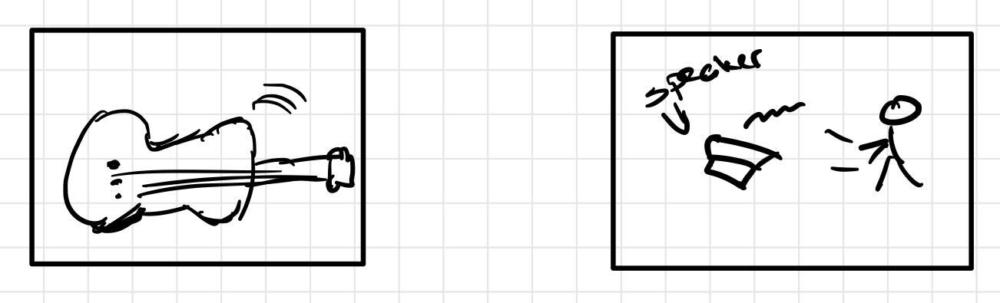

# Little Interactions Everywhere

**NAMES OF COLLABORATORS HERE**

## Prep

1. Pull the new changes from the class interactive-lab-hub. (You should be familiar with this already!)
2. Install [MQTT Explorer](http://mqtt-explorer.com/) on your laptop. If you are using Mac, MQTT Explorer only works when installed from the [App Store](https://apps.apple.com/app/apple-store/id1455214828).
3. Readings before class:
   * [MQTT](#MQTT)
   * [The Presence Table](https://dl.acm.org/doi/10.1145/1935701.1935800) and [video](https://vimeo.com/15932020)


## Overview

The point of this lab is to introduce you to distributed interaction. We have included some Natural Language Processing (NLP) and Generation (NLG) but those are not really the emphasis. Feel free to dig into the examples and play around the code which you can integrate into your projects if wanted. However, we want to emphasize that the grading will focus on your ability to develop interesting uses for messaging across distributed devices. Here are the four sections of the lab activity:

A) [MQTT](#part-a)

B) [Send and Receive on your Pi](#part-b)

C) [Streaming a Sensor](#part-c)

D) [The One True ColorNet](#part-d)

E) [Make It Your Own](#part-)

## Part 1.

### Part A
### MQTT

MQTT is a lightweight messaging portal invented in 1999 for low bandwidth networks. It was later adopted as a defacto standard for a variety of [Internet of Things (IoT)](https://en.wikipedia.org/wiki/Internet_of_things) devices. 

#### The Bits

* **Broker** - The central server node that receives all messages and sends them out to the interested clients. Our broker is hosted on the far lab server (Thanks David!) at `farlab.infosci.cornell.edu/8883`. Imagine that the Broker is the messaging center!
* **Client** - A device that subscribes or publishes information to/on the network.
* **Topic** - The location data gets published to. These are *hierarchical with subtopics*. For example, If you were making a network of IoT smart bulbs this might look like `home/livingroom/sidelamp/light_status` and `home/livingroom/sidelamp/voltage`. With this setup, the info/updates of the sidelamp's `light_status` and `voltage` will be store in the subtopics. Because we use this broker for a variety of projects you have access to read, write and create subtopics of `IDD`. This means `IDD/ilan/is/a/goof` is a valid topic you can send data messages to.
*  **Subscribe** - This is a way of telling the client to pay attention to messages the broker sends out on the topic. You can subscribe to a specific topic or subtopics. You can also unsubscribe. Following the previouse example of home IoT smart bulbs, subscribing to `home/livingroom/sidelamp/#` would give you message updates to both the light_status and the voltage.
* **Publish** - This is a way of sending messages to a topic. Again, with the previouse example, you can set up your IoT smart bulbs to publish info/updates to the topic or subtopic. Also, note that you can publish to topics you do not subscribe to. 


**Important note:** With the broker we set up for the class, you are limited to subtopics of `IDD`. That is, to publish or subcribe, the topics will start with `IDD/`. Also, setting up a broker is not much work, but for the purposes of this class, you should all use the broker we have set up for you!


#### Useful Tooling

Debugging and visualizing what's happening on your MQTT broker can be helpful. We like [MQTT Explorer](http://mqtt-explorer.com/). You can connect by putting in the settings from the image below.


Once connected, you should be able to see all the messages under the IDD topic. , go to the **Publish** tab and try publish something! From the interface you can send and plot messages as well. Remember, you are limited to subtopics of `IDD`. That is, to publish or subcribe, the topics will start with `IDD/`.


### Part B
### Send and Receive on your Pi

[sender.py](./sender.py) and and [reader.py](./reader.py) show you the basics of using the mqtt in python. Let's spend a few minutes running these and seeing how messages are transferred and shown up. Before working on your Pi, keep the connection of `farlab.infosci.cornell.edu/8883` with MQTT Explorer running on your laptop.

**Running Examples on Pi**

* Install the packages from `requirements.txt` under a virtual environment, we will continue to use the `circuitpython` environment we setup earlier this semester:

  ```
  pi@raspberrypi:~/Interactive-Lab-Hub $ source circuitpython/bin/activate
  (circuitpython) pi@raspberrypi:~/Interactive-Lab-Hub $ cd Lab\ 6
  (circuitpython) pi@raspberrypi:~/Interactive-Lab-Hub/Lab 6 $ pip install -r requirements.txt
  ...
  ```
* Run `sender.py`, fill in a topic name (should start with `IDD/`), then start sending messages. You should be able to see them on MQTT Explorer.

  ```
  (circuitpython) pi@raspberrypi:~/Interactive-Lab-Hub/Lab 6 $ python sender.py
  >> topic: IDD/AlexandraTesting
  now writing to topic IDD/AlexandraTesting
  type new-topic to swich topics
  >> message: testtesttest
  ...
  ```
* Run `reader.py`, and you should see any messages being published to `IDD/` subtopics. Type a message inside MQTT explorer and see if you can receive it with `reader.py`.

  ```
  (circuitpython) pi@raspberrypi:~ Interactive-Lab-Hub/Lab 6 $ python reader.py
  ...
  ```


**\*\*\*Consider how you might use this messaging system on interactive devices, and draw/write down 5 ideas here.\*\*\***

>Sketches:
> 1. Remote controlled watering plant device. This should help users to be able to take care of their house plants if there are not home for an extended period of time (i.e. vacation).
> 
> 2. Synchronized alarms. I envision this to be most useful for a camp field trip type of situation. For example, during a camping trip, a teacher can set all of the students' alarms depedning on what time the activities are.
> 
> 3. Robotically controlled arms. By linking up a user's arms to gyro sensors, a user can then control robotic arms located remotely. This could be useful for scenarios where the user is unable to get close to the object they need to manipulate.
> 
> 4. Sign language inclusive chatroom. By using a camera to vision track sign language movements, it can be poossible to convert it into audible speech for other users in the chatroom facilitating the overall social interaction.
> 
> 5. Remote music playing. By creating a music instrument capable of sensing where on the instrument the user is touching at the moment, it can be possible to translate those motions into audible sound maybe listened to by a conductor or instructor elsewhere.
> 


### Part C
### Streaming a Sensor

We have included an updated example from [lab 4](https://github.com/FAR-Lab/Interactive-Lab-Hub/tree/Fall2021/Lab%204) that streams the [capacitor sensor](https://learn.adafruit.com/adafruit-mpr121-gator) inputs over MQTT. We will also be running this example under `circuitpython` virtual environment.

Plug in the capacitive sensor board with the Qwiic connector. Use the alligator clips to connect a Twizzler (or any other things you used back in Lab 4) and run the example script:

<p float="left">


</p>

 ```
 (circuitpython) pi@raspberrypi:~ Interactive-Lab-Hub/Lab 6 $ python distributed_twizzlers_sender.py
 ...
 ```

**\*\*\*Include a picture of your setup here: what did you see on MQTT Explorer?\*\*\***

> I saw that the pi was sending messages into the your/topic/here subdirectory concerning which "twizzler" was currently being touched.
> 

**\*\*\*Pick another part in your kit and try to implement the data streaming with it.\*\*\***
 
> This piece of code implements streaming for the rotary encoder
```
seesaw = seesaw.Seesaw(board.I2C(), addr=0x36)
seesaw.pin_mode(24, seesaw.INPUT_PULLUP)
button = digitalio.DigitalIO(seesaw, 24)
button_held = False
encoder = rotaryio.IncrementalEncoder(seesaw)

last = encoder.position

while True:
    if encoder.position != last:
        val = "The encoder has been rotated to: " + str(encoder.position)
        client.publish(topic, val)
    last = encoder.position
    time.sleep(0.25)
```


### Part D
### The One True ColorNet

It is with great fortitude and resilience that we shall worship at the altar of the *OneColor*. Through unity of the collective RGB, we too can find unity in our heart, minds and souls. With the help of machines, we can overthrow the bourgeoisie, get on the same wavelength (this was also a color pun) and establish [Fully Automated Luxury Communism](https://en.wikipedia.org/wiki/Fully_Automated_Luxury_Communism).

The first step on the path to *collective* enlightenment, plug the [APDS-9960 Proximity, Light, RGB, and Gesture Sensor](https://www.adafruit.com/product/3595) into the [MiniPiTFT Display](https://www.adafruit.com/product/4393). You are almost there!

<p float="left">
  
  
  
</p>


The second step to achieving our great enlightenment is to run `color.py`. We have talked about this sensor back in Lab 2 and Lab 4, this script is similar to what you have done before! Remember to activate the `circuitpython` virtual environment you have been using during this semester before running the script:

 ```
 (circuitpython) pi@raspberrypi:~ Interactive-Lab-Hub/Lab 6 $ python color.py
 ...
 ```

By running the script, wou will find the two squares on the display. Half is showing an approximation of the output from the color sensor. The other half is up to the collective. Press the top button to share your color with the class. Your color is now our color, our color is now your color. We are one.

(A message from the previous TA, Ilan: I was not super careful with handling the loop so you may need to press more than once if the timing isn't quite right. Also, I haven't load-tested it so things might just immediately break when everyone pushes the button at once.)

You may ask "but what if I missed class?" Am I not admitted into the collective enlightenment of the *OneColor*?

Of course not! You can go to [https://one-true-colornet.glitch.me/](https://one-true-colornet.glitch.me/) and become one with the ColorNet on the inter-webs. Glitch is a great tool for prototyping sites, interfaces and web-apps that's worth taking some time to get familiar with if you have a chance. Its not super pertinent for the class but good to know either way. 

**\*\*\*Can you set up the script that can read the color anyone else publish and display it on your screen?\*\*\***
> This is already implemented most of the way in color.py on the message callback, and all that needs to be changed is to fill the in the rectangle completely
```
def on_message(cleint, userdata, msg):
    # if a message is recieved on the colors topic, parse it and set the color
    if msg.topic == topic:
        colors = list(map(int, msg.payload.decode('UTF-8').split(',')))
        draw.rectangle((0, 0, width, height), fill=color)
        disp.image(image)
```

### Part E
### Make it your own

Find at least one class (more are okay) partner, and design a distributed application together based on the exercise we asked you to do in this lab.
>I had a pretty erratic schedule over the weekend, as I was at a family wedding, so I decided to go at the lab alone to not inconvenience others.

**\*\*\*1. Explain your design\*\*\***

>I made a IoT trashcan prototype mainly based on my work in product studio this semester. One of our ideas was to create trashcans that essentially determien how full they are, and this will help sanitation/garbage collection agencies navigate the city and pick up trash. This should also help with alleviating garbage truck traffic throughout by optimizing routes in addition to providing for a cleaner city with less trash overflow. Given the parts I had within the kit, I decided to go with the proximity sensor as the way to detect if the bin was full. I had a lego trashcan model that seemed to be the perfect fit, and, while I would have preferred a multi laser sensor/sensor that could detect distances over multiple areas, the included sensor would be good enough for a rough prototype. 

**\*\*\*2. Diagram the architecture of the system.\*\*\*** 

>Implementation in real life:
> 

>Implementation in prototype:
> 

**\*\*\*3. Build a working prototype of the system.\*\*\*** 

**Parts used:**
> Software:
>  - MQTT library
>  - Ceritfi library
>  - apds9960 library
>  - st7789 library

> Hardware:
>  - apds9960 for garbage level sensing
>  - st7789 for full or not full indication
>  - pi as trash bin device
>  - laptop as trash fleet handler device
>  - lego trash can for ... trash bin :D

**Code used:**
>Garbage Bin:
```
def on_message(cleint, userdata, msg):
    global bin_full
    if msg.topic == topic:
        message = msg.payload.decode('UTF-8')
        print(message)
        if message == "Close bin":
            draw.rectangle((0, 0, width, height), fill=(255, 0, 0))
            bin_full = True
        if message == "Open bin":
            draw.rectangle((0, 0, width, height), fill=(0, 255, 0))
            bin_full = False
        disp.image(image)

...

while True:
    if (sensor.proximity > 190 and not bin_full):
        client.publish(topic, "bin is full")
        bin_full = True
    disp.image(image)
    time.sleep(.01)
```

>Fleet Manager:
```
def on_message(cleint, userdata, msg):
    if msg.topic == topic and msg.payload.decode('UTF-8') == "bin is full":
        print("The bin has filled up")
    if msg.topic == topic and msg.payload.decode('UTF-8') == "Open bin":
        print("Bin 1 has opened up, current bin layout is:")
        print("O || O || O || O")
    if msg.topic == topic and msg.payload.decode('UTF-8') == "Close bin":
        print("Bin 1 has filled up, current bin layout is:")
        print("X || O || O || O")
```

**Picture of final system:**
> 

**UI explained**
> There really is not much to the UI of the system other than the light turning between red and green for closed and open. I think that is pretty intuitive, as it follows traditional color meanings. For the fleet manager, they also only have to consider inputting text, but I feel that would be better done with a full application rather than a terminal only interface. Perhaps in the terminal I could have also prompted the user for an Open or Close bin command.

**Challenges**
> 1. I was unable to get the servo motor to work after multiple tries with different batteries and servo ports. Not entirely sure what I did wrong, as I was able to use it in previous labs, but because of that problem, I ended up just ditching it.
> 2. Because the proximity sensor only senses distance in "one point", the trash in this prototype example needed to be positioned over only a specific part of the trash can floor. In a real world version, I would like to use a more sophisticated sensor that would be able to account for varying levels of trash with respect to their position within the bin.
> 3. Struggled with linking my laptop to the MQTT broker due to not having the correct SSL certification. Don't know why this works, but was able to just download a ceritifier python library that gave me the credentials I needed.

**\*\*\*4. Document the working prototype in use.\*\*\*** 

>[Link to video]('https://youtu.be/zRZNK_Zf-OE')

<!--**\*\*\*5. BONUS (Wendy didn't approve this so you should probably ignore it)\*\*\*** get the whole class to run your code and make your distributed system BIGGER.-->

